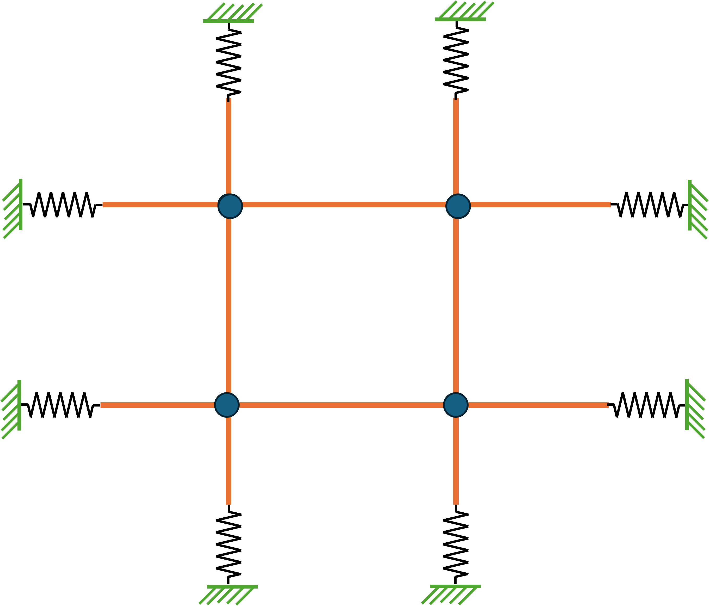

# Fiber Network Simulation

This repository provides a simulation framework for modeling fiber networks made up of soft, flexible rods or threads. It uses PyElastica to model these fibers as Cosserat rods and allows users to configure and simulate networks of fibers with various physical properties and external forces. The following image depicts an example network of 2 horizontal and 2 vertical rods. These rods are connected to each other using virtual spring-damper systems and they are subjected to tensile forces at the ends. A stimulating force is being applied to one of these rods in order to observe the dynamics and perform further computations using this system.



- **Customizable Parameters**: Size of the network, Length, diameter, density and Young's modulus of the rods, tension force applied at the ends, magnitude and type of the stimulating force (point force), spread of the point force, properties of the connections, and duration of the simulation.
- **Different Force Types**: Supports constant, sinusoidal, and spline-based forces which can be applied at a single node or spread across multiple neighboring nodes.
- **Visualization Support**: Generates simulation videos using Matplotlib.
- **Data Logging**: Utilizes PyElastica's callback functionality to store simulation data.

## Installation

Ensure you have Python installed along with the required dependencies:

```bash
pip install pyelastica numpy matplotlib scipy tqdm
```

## Usage

1. Modify the simulation parameters in `fiber_config.py`.
2. Run the simulation:
   ```bash
   python fiber_config.py
   ```

## File Structure

- `fiber_config.py`: Defines parameters and launches the simulation.
- `fiber_simulation.py`: Contains the core simulation logic using PyElastica.
- `utils/`: Contains helper modules for forces, rendering, and data storage.

### `utils` Folder

- `forces/`:
  - `pointforce.py`: Defines different force types applied to fibers, including constant, sinusoidal, and spline forces.
  - `pullingforce.py`: Implements pulling forces exerted by cells on fibers.

- `render/`:
  - `post_processing.py`: Uses Matplotlib to create visualization videos of the simulation.

- `network_callback.py`: Implements PyElastica's callback functionality to store and retrieve simulation data.

- `unit_scaling.py`: Provides funcitonality to scale quantities in SI units to non-SI units.

## Unit Scaling

The simulation uses a non-SI unit system for better numerical stability. Below is the scaling of SI units to the custom units used in the repository:

| **Quantity** | **SI Units** | **Scaling 1** (mm, g, s) | **Scaling 2** (mm, mg, ms) |
| ------------ | ------------ | ---------------------- | ----------------------- |
| Length       | m            | \(10^3\) mm            | \(10^2\) mm             |
| Mass         | kg           | \(10^3\) g             | \(10^6\) mg             |
| Time         | s            | s                      | \(10^3\) ms             |
| Force        | N = kg·m/s²  | \(10^6\) g·mm/s²       | \(10^3\) mg·mm/ms²      |
| Density      | kg/m³        | \(10^{-6}\) g/mm³      | \(10^{-3}\) mg/mm³      |
| Modulus      | Pa = kg/ms²  | \(1\) g/(mm·s²)        | \(10^{-3}\) mg/(mm·ms²) |

This unit conversion is reflected in the comments of `fiber_simulation.py` and `fiber_config.py` for consistency.

## Output

- **Video Visualization**: A `.mp4` video of the simulation (if enabled).
- **Pickle Data**: Saves simulation results in a `.pickle` file for further analysis.

